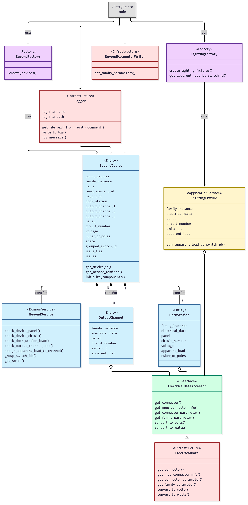

# Beyond Revit Family Automation

*English below*

Executa uma suíte de testes nas famílias elétricas da Autodesk Revit para os produtos da beyond.dm.

Performs a test suite on electrical Revit Families for beyond.dm products.

## 📋 Sobre o Projeto / About the Project

Este script acompanha as famílias Beyond para Revit e deve ser executado após a inserção de todas as instâncias no projeto MEP.

A rotina coleta informações de elementos como circuitos, painéis de distribuição, dispositivos elétricos, luminárias, espaços e outros atributos do modelo. Utilizando essas informações de contexto, o script executa uma bateria de testes para identificar discrepâncias e preenche os parâmetros específicos dos objetos Beyond com dados relevantes para os projetistas.

Ao final da execução, um arquivo de log (relatório) é salvo na raiz do projeto `.rvt`, documentando quais objetos foram instalados corretamente e quais apresentam problemas, detalhando os erros encontrados.

---

This script is designed to work with Beyond's Revit families and should be run after all instances have been placed in the MEP project.

The routine collects data from elements such as circuits, distribution panels, electrical devices, light fixtures, spaces, and other model attributes. Using this contextual information, it runs a series of tests to identify discrepancies and populates the specific parameters of Beyond objects with relevant information for designers.

Upon completion, a log file (test report) is saved in the root of the `.rvt` project, documenting which objects are correctly installed and which have issues, specifying the encountered errors.

## 🛠️ Requirements / Requisitos

**Minimum Requirements:**
- Autodesk Revit 2025.2
- Dynamo Core 3.2.1
- Python 3.x (included with Dynamo)

**Dependências / Dependencies:**
- Revit API (included with Revit)
- RevitNodes, RevitServices (included with Dynamo)
- Beyond Revit Families (must be loaded in project)

## 🚀 Utilização / How to Use

1.  Insira as famílias Beyond no modelo MEP do Revit.
2.  Abra o Dynamo Player ou Editor dentro do Revit.
3.  Carregue o gráfico Dynamo (.dyn) que contém este script.
4.  Execute o script a partir do nó Python.
5.  Verifique o arquivo de log gerado na raiz do projeto para os resultados.

---

1.  Insert the Beyond families into the Revit MEP model.
2.  Open the Dynamo Player or Editor within Revit.
3.  Load the Dynamo graph (.dyn) that contains this script.
4.  Execute the script from the Python node.
5.  Check the generated log file in the project's root directory for the results.

## 📊 Diagrama de Classes UML / UML Class Diagram

